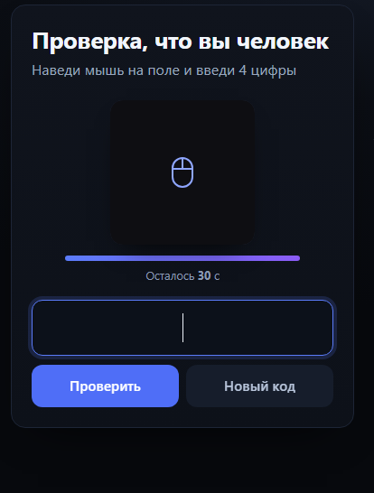

# 🎯 jevkray-captcha-v3

**🌐 Langues :** [English](README.md) · [Русский](README.ru.md) · [中文](README.zh.md) · [日本語](README.ja.md) · **Français** · [Español](README.es.md)

**🚀 Essayer en ligne :** <https://jevkray.github.io/jevkray-captcha-v3/>

> Un CAPTCHA visuel où le code à 4 chiffres est composé **des mêmes points que le bruit de fond** — aucun calque de texte séparé.



---

## ✨ De quoi s'agit-il

Sur un champ de 160×160, ~9200 points colorés forment une mosaïque dense en mouvement. Le code n'existe que comme **un groupe de points** : il s'assemble en un bloc mouvant qui se comporte comme une gelée vivante — il s'étire, respire, pulse en taille, tandis que des ondulations et tourbillons globaux (une « lentille liquide ») passent par-dessus.

Une image seule est presque indiscernable du fond : densité des points, durée de vie et fréquence d'apparition dans les traits des chiffres et dans le fond sont volontairement égalisées — principe *zero knowledge per frame*. Dans la version web, les images arrivent en flux temps réel : aucun fichier téléchargeable, et sans survol le champ est entièrement masqué.

## ⚙️ Comment ça marche

| # | Étape |
|---|---|
| 1 | Champ dense et uniforme : pas de grille 2 px, points 1–2 px, palette de 6 couleurs harmonieuses. |
| 2 | Première seconde : le code est invisible — les points des chiffres suivent simplement le flux du fond. |
| 3 | Les 1,5 s suivantes : les points s'envolent depuis des positions aléatoires vers leurs cellules (assemblage). |
| 4 | Ensuite le texte vit comme une gelée : translation + rotation ±12° + « respiration » ±2,5 px + déformation des traits, déchirures/recollages de cellules et pulsation de taille ±25 %. |
| 5 | Un point qui dérive dans une cellule est « capturé » et se met à bouger avec le texte (aucun masquage, aucun artefact d'apparition/disparition). |
| 6 | Par-dessus — une « lentille liquide » (ondulations globales et tourbillons) ; des déchirures et des trous dérivent sur le fond. |
| 7 | Les images sont diffusées en flux à 20 fps, impossible de les retélécharger ; la réponse est vérifiée par hachage SHA-256 salé côté serveur, le code vit 30 s. |

## 🚀 Démarrage rapide

**Application web** (.NET 10) : `dotnet run --urls http://localhost:5199`
Configuration : `appsettings.json` → `CapGen:Path`, `CapGen:Digits`, `CapGen:Fps`, `CapGen:Seconds`, `CapGen:Mode` (`classic` ou `jelly`).

**Générateur** (Rust) :

```bash
cd generator
cargo build --release
./target/release/capgen.exe 4821 out.gif 20 30 jelly   # code, fichier, fps, secondes, mode (classic|jelly) ; l'extension .bin écrit les images brutes pour le streaming
```

## 🧪 Comment tester (modèles et humains)

1. Créer un jeu étiqueté : `./generator/eval.ps1 -N 100`
2. Donner le GIF (ou les planches de sprites de `samples/`) à un modèle avec ce prompt :

> Analyse cette animation. Un code à 4 chiffres y est caché : c'est le seul groupe de points se déplaçant comme un corps unique. Écris un algorithme (Python + Pillow/PyAV) qui lit les 4 chiffres du fichier GIF et mesure sa précision sur les exemples fournis.

3. Calculer les résultats : `./metrics.ps1 -Csv answers.csv`

## 🏆 Défi public

- **Objectif :** un solveur qui lit 4 chiffres dans un seul GIF — ≥ **50 %** de correspondances exactes sur un jeu caché de 100 GIF.
- **Autorisé :** toute approche CV/ML, entraînement sur vos propres données (le générateur est ouvert).
- **Interdit :** lire la réponse dans les métadonnées, utiliser les étiquettes du jeu caché, fermes humaines.
- Règles complètes : [`CONTEST.md`](CONTEST.md)

## 📊 Référence (mesurée)

| Solveur | Correspondances exactes | Par chiffre |
|---|---|---|
| Attaque CV de référence (`generator/src/bin/solve.rs`) | **0 / 50** | ~10–13 % (hasard) |
| La même attaque avant durcissement (version initiale) | 91 / 100 | 97,5 % |

## 📁 Structure du dépôt

```
generator/         Rust : capgen (GIF/raw, modes classic/jelly) + solve.rs et solve2.rs (attaques de référence)
Pages/, wwwroot/   application ASP.NET Core Razor Pages (UI sombre, 6 langues)
samples/           6 GIF étiquetés + planches de sprites (labels.csv sert à la notation)
docs/              capture d'écran
eval.ps1           génère N GIF et évalue le solveur de référence
metrics.ps1        précision + tableau « succès en N tentatives »
CONTEST.md         règles du défi public
NOTICE.md          paternité, date, empreintes SHA-256 des sources
```

## ⚖️ Licence et propriété

© 2026 **jevkray**. Tous droits réservés. Étude, exécution locale, tests et revues publiques autorisés avec attribution ; usage commercial sur autorisation écrite. Voir [`LICENSE.txt`](LICENSE.txt) et [`NOTICE.md`](NOTICE.md).

## 🔗 Liens

- GitHub : [github.com/Jevkray](https://github.com/Jevkray)
- Paquet du défi : [github.com/Jevkray/jevkray-captcha-v3](https://github.com/Jevkray/jevkray-captcha-v3)

## 📬 Contact

- ✉️ Email: [krasovskyworks@gmail.com](mailto:krasovskyworks@gmail.com)
- ✈️ Telegram: [@eugenekray](https://t.me/eugenekray)
- ☕ Boosty: [boosty.to/jevkray](https://boosty.to/jevkray)
